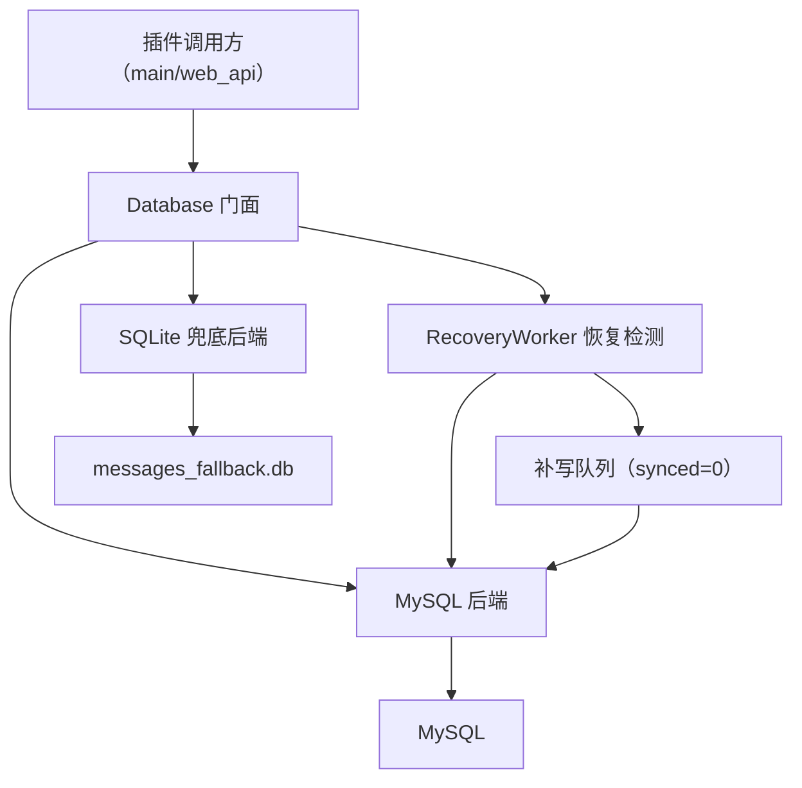
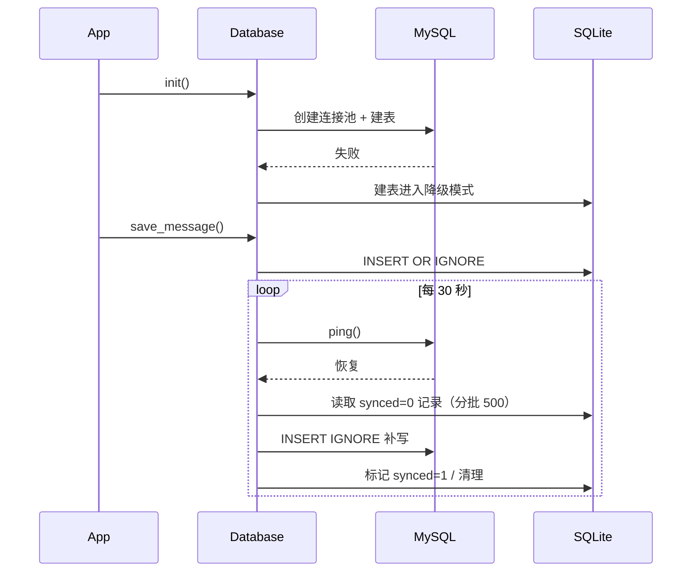

# Local Storage Fallback Design

Feature Name: local-storage-fallback
Updated: 2026-08-09

## Description

为消息记录器增加 SQLite 本地兜底存储：默认使用 MySQL，MySQL 故障时自动降级到
SQLite，恢复后自动切回并补写。目标是"消息不丢 + 降级期功能完整可用"。

与爱发电 `order_db.py` 的 MySQL+SQLite 兜底模式一致，但覆盖 `Database` 的完整
读写面（约 30 个方法），并新增 MySQL 恢复检测与补写机制。

## Architecture



降级时序：



## Components and Interfaces

### `Database`（门面，重构现有类）

保持现有对外方法签名不变（`save_message`、`query_messages`、`count_messages`、
`get_stats`、`get_timeline_stats`、`get_sender_ranking`、`get_group_ranking`、
`get_content_type_stats`、`get_platform_detail_stats`、`get_platform_stats`、
`get_message_by_id`、`get_message_by_platform_id`、`get_existing_message_ids`、
`get_context_messages`、`get_media_paths_*`、`cleanup_by_age/limit` 等），
内部增加后端状态与分派：

- `self._mysql_ready: bool` — MySQL 是否可用
- `self._fallback_enabled: bool` — 配置 `storage_fallback_enabled`（默认 true）
- `self._sqlite: Optional[SQLiteStore]` — 兜底后端（仅需时创建）
- `self._recovery_task: Optional[asyncio.Task]` — 恢复检测后台任务

分派模式（参考 `order_db._query_mysql`）：

```python
async def _run(self, mysql_coro_fn, sqlite_coro_fn):
    """MySQL 优先执行，故障时降级 SQLite。"""
    if not self._mysql_ready:
        return await sqlite_coro_fn()
    try:
        return await mysql_coro_fn()
    except Exception as e:
        self._mysql_ready = False
        logger.warning(f"[FoxToolbox] MySQL 故障，降级 SQLite: {e}")
        return await sqlite_coro_fn()
```

每个公开方法拆为 `_<name>_mysql` 与 `_<name>_sqlite` 两个私有实现，
由 `_run` 分派。降级一旦发生保持到恢复检测成功为止（避免抖动）。

`init()` 流程：

1. 尝试 MySQL：`aiomysql.create_pool` + 建表 + schema 迁移
2. 失败且 `_fallback_enabled`：创建 `SQLiteStore`，`_mysql_ready=False`
3. 启动 `RecoveryWorker`（MySQL 可用时也运行，用于切回与补写）

### `SQLiteStore`（新模块 `fox_toolbox/sqlite_store.py`）

- 使用标准库 `sqlite3` + `asyncio.to_thread`，不引入新依赖
- 文件路径：`Path(get_astrbot_plugin_data_path()) / PLUGIN_DIR_NAME / "messages_fallback.db"`
- 对外提供与 `Database` 读取/写入一致的 `async` 方法，内部全部使用
  SQLite 原生 SQL（`?` 占位符、`INSERT OR IGNORE`、`LIMIT ? OFFSET ?`）
- 关键词：`LIKE`（无 FTS，行为与 MySQL 的 LIKE 兜底分支一致）
- 排行/时间线/内容类型统计：复用 Python 端聚合逻辑（现有 MySQL 实现
  中这些方法本就是全表拉取 + Python 聚合，SQLite 取行后走同一聚合函数）

### `RecoveryWorker`（`Database._recovery_loop`）

- 每 `recovery_check_interval`（默认 30s）执行一次
- `_mysql_ready=False` 时：`ping()` 成功则 `_mysql_ready=True` 并执行补写
- `_mysql_ready=True` 时：无需动作（降级不会在 MySQL 正常时发生）
- 补写：`SQLiteStore.get_unsynced_ids(batch=500)` →
  `save_messages_batch`（`INSERT IGNORE` 依赖 `content_hash` 去重）→
  `SQLiteStore.mark_synced(ids)` → 周期性 `SQLiteStore.cleanup_synced()`

## Data Models

### SQLite `messages` 表

```sql
CREATE TABLE IF NOT EXISTS messages (
    id INTEGER PRIMARY KEY AUTOINCREMENT,
    platform TEXT NOT NULL,
    message_id TEXT,
    session_id TEXT,
    group_id TEXT,
    channel_id TEXT,
    sender_id TEXT NOT NULL,
    sender_name TEXT,
    message_type TEXT NOT NULL,
    message_str TEXT,
    message_chain TEXT,
    raw_message TEXT,
    reply_to_id TEXT,
    content_hash TEXT,
    content_types TEXT,
    timestamp INTEGER NOT NULL,
    created_at INTEGER NOT NULL,
    synced INTEGER NOT NULL DEFAULT 0
);
CREATE UNIQUE INDEX IF NOT EXISTS idx_content_hash ON messages(content_hash);
CREATE INDEX IF NOT EXISTS idx_platform ON messages(platform);
CREATE INDEX IF NOT EXISTS idx_timestamp ON messages(timestamp);
CREATE INDEX IF NOT EXISTS idx_sender ON messages(sender_id);
CREATE INDEX IF NOT EXISTS idx_group ON messages(group_id);
CREATE INDEX IF NOT EXISTS idx_synced ON messages(synced);
```

- `synced` 列仅存在于 SQLite 侧，标记是否已补写进 MySQL；查询按显式列名，
  不影响与 MySQL 数据结构的兼容性
- `content_hash` 唯一索引保证降级写入与补写阶段均幂等去重

### 配置项（`metadata.yaml` + `AstrBotConfig`）

| key | default | 说明 |
|-----|---------|------|
| `storage_fallback_enabled` | `true` | 是否启用 SQLite 自动兜底 |
| `recovery_check_interval` | `30` | MySQL 恢复检测间隔（秒） |
| `backfill_batch_size` | `500` | 单批补写条数 |
| `sqlite_max_retention_days` | `30` | 已同步记录在 SQLite 的保留天数 |

## Correctness Properties

1. **消息不丢**：MySQL 不可用时消息写入 SQLite；MySQL 恢复后全部补写回 MySQL
2. **幂等去重**：`content_hash` 唯一索引 + `INSERT OR IGNORE`/`INSERT IGNORE`，
   降级写入与补写均不会产生重复
3. **单写后端**：任意时刻只有 MySQL 或 SQLite 之一接受写入，避免双写不一致
4. **不阻塞事件循环**：SQLite 同步 API 全部经 `asyncio.to_thread` 执行
5. **恢复后单调性**：切回 MySQL 前先完成当前轮补写，未补写完成不开始新消息的
   MySQL 写入（补写按批推进，期间新消息仍写 SQLite）

## Error Handling

| 场景 | 处理 |
|------|------|
| MySQL 启动失败 | 日志警告，进入降级；WebUI 状态卡片显示 SQLite 降级 |
| MySQL 运行期单次写入失败 | 降级标记置 False，本条消息写入 SQLite |
| SQLite 初始化/写入失败 | 记录错误日志，降级为无持久化（与现状 MySQL 挂掉行为一致），不崩溃 |
| 补写单批失败 | 记录警告，保留 `synced=0`，下轮重试 |
| 恢复检测 ping 失败 | 忽略，下轮再试 |

## Test Strategy

- **单元测试（SQLiteStore，无需 MySQL）**：建表、保存去重（同 `content_hash`
  二次保存返回 -1/跳过）、查询/计数/排行/时间线/内容类型/平台详情与 MySQL
  数据结构一致、`mark_synced`/`get_unsynced_ids`/`cleanup_synced`
- **降级分派测试（mock MySQL）**：MySQL 抛错 → 自动降级写入 SQLite 并返回；
  `_mysql_ready` 状态正确切换
- **恢复与补写测试（mock 连接池）**：`ping` 恢复 → 补写 `synced=0` 记录 →
  去重不产生重复 → 标记 synced → 清理
- **配置开关测试**：`storage_fallback_enabled=false` 时故障行为与现状一致
- **回归**：全量 pytest 保持通过；现有 MySQL 单测仍走真实 MySQL（本地不可用时
  skip，与本仓库现状一致）

## References

[^1]: `fox_toolbox/afdian/order_db.py` - 现有 MySQL+SQLite 兜底实现（模式参考）
[^2]: `fox_toolbox/database.py` - 待改造的消息存储类（约 30 个读写方法）
[^3]: `fox_toolbox/redis_cache.py` - 统计/最近消息缓存（降级模式继续更新）
